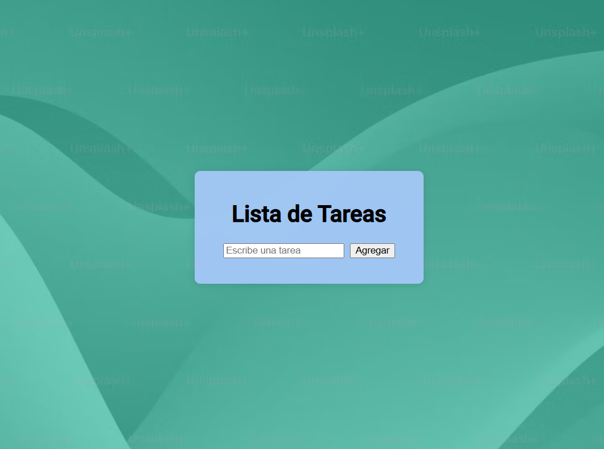

# Lista de Tareas 📝

Esta es una aplicación simple de lista de tareas (To Do List) desarrollada con **React** y **JavaScript**. Permite al usuario agregar tareas de forma dinámica a una lista, con una interfaz limpia y funcional.

## Tecnologías utilizadas

- React
- JavaScript
- HTML/CSS

## Vista previa



## Cómo ejecutar el proyecto

1. Cloná el repositorio:
   ```bash
   git clone https://github.com/GamaDavid12/To_Do.git
